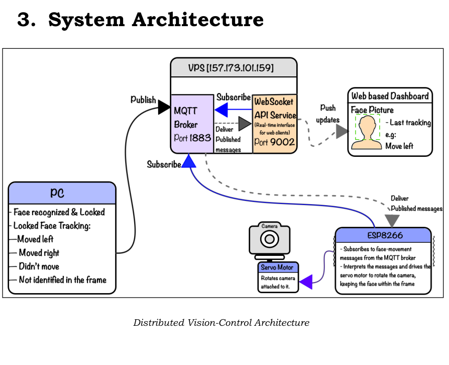

# 👁️ Distributed Vision-Control System (Phase 1)

**Team ID:** `y3c_ajhm`
**Course:** Distributed Systems / Computer Vision
**Phase:** 1 (Open-Loop Actuation & Simulation)

> **Based on Previous Work:** This project builds upon the Face Locking behavioral analysis system. You can view the original foundation here:
> 🔗 [FaceLocking Repository](https://github.com/DannyMikeGanzaRwabuhama/FaceLocking.git)

---

## 1. 📝 Project Overview

This project implements a **distributed face-tracking system** where a PC-based vision engine detects a face, publishes movement commands to a central MQTT broker, and an ESP8266 edge controller moves a servo motor in response. A real-time web dashboard visualizes the system state via WebSocket.

The system is designed to be **loosely coupled**:

* 🧠 **Vision Node:** Produces data (Publisher)
* 🤖 **Edge Node:** Consumes commands (Subscriber)
* 📺 **Dashboard:** Visualizes state (Passive Subscriber)

---

## 2. 🏗️ System Architecture

The system follows a strict **Publisher-Subscriber** model using a central VPS broker.



### 🧩 Components

1. **Vision Node (PC) 💻**
* **Function:** Captures video from the webcam.
* **Tech Stack:** Uses **ArcFace** for face recognition and **MediaPipe** for tracking.
* **Logic:** Calculates positional error (Left/Right/Center).
* **Output:** **Publishes** JSON commands to the MQTT broker.
* *Constraint:* No direct connection to ESP8266 or Browser.


2. **Edge Node (ESP8266) 📡**
* **Function:** Connects to WiFi and the MQTT Broker.
* **Input:** **Subscribes** to movement topics.
* **Action:** Parses JSON payloads and drives the Servo Motor.
* *Constraint:* No HTTP/WebSocket servers allowed.


3. **Web Dashboard 📊**
* **Function:** Connects to the **WebSocket API Service (Port 9002)**.
* **Display:** Visualizes real-time servo commands and tracking confidence.
* *Constraint:* Does not connect to MQTT (Port 1883) directly.


---

## 3. 📡 MQTT Configuration

To ensure isolation on the shared broker, we use a unique team namespace.

* **Broker IP:** `157.173.101.159`
* **Port:** `1883`
* **Base Topic:** `vision/y3c_ajhm/`

### Published Topics

| Topic | Publisher | Payload Description |
| --- | --- | --- |
| `vision/y3c_ajhm/movement` | Vision Node | JSON command for servo control. |

**Payload Format:**

```json
{
  "status": "MOVE_LEFT",   // Enum: MOVE_LEFT, MOVE_RIGHT, CENTERED, NO_FACE
  "confidence": 0.98,      // ArcFace similarity score (0.0 - 1.0)
  "timestamp": 1730000000  // Unix Epoch Time
}

```

---

## 4. 📂 Repository Structure

```text
FaceLockingServo/
├── dashboard/
│   └── index.html             # 📊 Real-time Web Visualization
├── edge_node/
│   └── firmware.ino           # 🤖 ESP8266 Arduino Firmware
├── vision_node/
│   ├── main.py                # 🧠 Main Vision Engine Entry Point
│   ├── haar_5pt.py            # 📏 Face Alignment Helper
│   └── models/
│       └── embedder_arcface.onnx  # 🎭 Face Recognition Model
├── requirements.txt           # 📦 Python Dependencies
└── README.md                  # 📖 System Documentation

```

---

## 5. 🚀 Setup & Execution Instructions

### Prerequisites

* 🐍 Python 3.9+
* ⚡ Arduino IDE (for ESP8266)
* 📷 Webcam

### Step 1: Vision Node (PC) 🧠

1. **Install dependencies:**
```bash
pip install -r requirements.txt

```


2. **Run the vision engine:**
```bash
python vision_node/main.py

```


3. **Verify:** The terminal will show `📡 Connected to MQTT` and start printing `SENT: MOVE_...` logs.

### Step 2: Edge Node (ESP8266) 🤖

1. Open `edge_node/firmware.ino` in Arduino IDE.
2. Install the **PubSubClient** library via Library Manager.
3. Update the `ssid` and `password` variables at the top of the file.
4. Flash the code to your NodeMCU/ESP8266.
5. **Verify:** Open Serial Monitor (9600 baud) to see `✅ WiFi connected` and `Message received...`.

### Step 3: Web Dashboard 📺

**Access Live Dashboard:**
👉 `http://157.173.101.159:9320/`

---

## 6. ⚠️ Known Issues & Network Limitations

During the evaluation phase, the following infrastructure constraints were documented:

1. **Dashboard WebSocket (Port 9002):**
The assignment requires connecting the dashboard to Port 9002 (`ws://157.173.101.159:9002`). During our testing, this port appeared unreachable/blocked from our network environment, preventing the dashboard from receiving data despite the code being correct.
2. **ESP8266 DHCP Failure:**
The ESP8266 hardware struggled to obtain an IP address (DHCP) on the campus "RCA" network, likely due to 5GHz/2.4GHz band steering issues or IP exhaustion.

---

## 7. 📐 Design Rationale & Architectural Decisions

During implementation, we strictly adhered to the **Phase 1: Open-Loop Actuation** constraints. This section clarifies key design decisions regarding telemetry and state visualization.

### 7.1. 🔄 The "Open-Loop" Visualization Paradox

**❓ Question:** *Why does the dashboard display "Servo Status" when the ESP8266 does not publish its physical position back to the broker?*

**💡 Rationale:**
In **Phase 1 (Simulation Stage)**, the system is architected as an Open-Loop control system.

1. **📡 Command Flow:** The Vision Node publishes an *intent* (`MOVE_LEFT`) to the MQTT Broker.
2. **🖥️ Visualization:** The Dashboard subscribes to this intent via the WebSocket Bridge. It visualizes **what the system is commanding**, not the physical telemetry of the servo.
3. **⚙️ Execution:** The ESP8266 subscribes to the same command and executes it blindly.

True feedback (Closed Loop) where the camera frame updates in response to movement is reserved for **Phase 2**. Therefore, the dashboard correctly reflects the **Control Stream** (the "Last movement status" requirement) rather than physical device telemetry.

### 7.2. 🎯 Confidence Scoring

**❓ Question:** *Why is the confidence score included in the payload?*

**💡 Rationale:**
The payload structure defined in **Section 4.1** strictly requires a `confidence` field. From a Computer Vision perspective, this serves as a critical "Tracking State" indicator.

* **🟢 High Confidence (>0.8):** Valid face lock; servo commands are trustworthy.
* **🟠 Low Confidence (<0.6):** Potential false positive; system should hold position (CENTERED) or scan.

Our dashboard visualizes this score to assist in debugging lighting or occlusion issues in real-time.

### 7.3. 🛡️ Compliance with "Forbidden Practices"

We verified our architecture against the strict exclusion list:

* ✅ **🔌 No Direct Device Talk:** PC never communicates directly with ESP8266; all traffic routes through `157.173.101.159:1883`.
* ✅ **🌐 No Browser MQTT:** Dashboard uses `ws://...:9002` (WebSocket Bridge), strictly avoiding `mqtt.js` or direct Broker connections.
* ✅ **🔒 Topic Isolation:** All traffic is confined to `vision/y3c_ajhm/` to prevent cross-team interference.